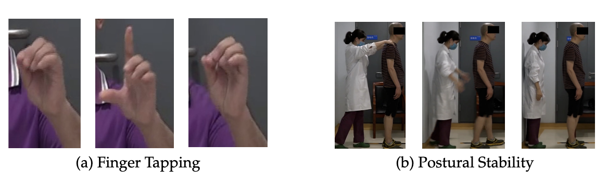
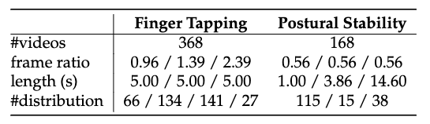

# PDMotorDB: Parkinson's Disease(PD) Motor Dataset in Finger Tapping and Postural Stability

## Dataset Overview

The action of finger tapping and postural stability are collected from the hospital with real PD patients. The definition of those actions is in section 3.4 and section 3.12 in [MDS-UPDRS](https://www.movementdisorders.org/MDS/MDS-Rating-Scales/MDS-Unified-Parkinsons-Disease-Rating-Scale-MDS-UPDRS.htm) respectively.

The finger tapping and postural stability are collected independently with 368 and 168 patients respectively. The hand position is cropped from the original videos and the postural stability video keeps the original resolution. To protect the privacy of patients, all private information has been removed from the videos. 

**Example video:**

 [Finger Tapping Demo](./finger_tapping_demo.mp4) 
 
 [Postural Stability Demo](./postural_stability_demo.mp4)

## Download

This dataset is only for academic usage.

You **SHOULD** sign an agreement before downloading the dataset.

Application channel will open soon

## Declaration 

This study was approved by the Ethics Committee of Beijing Tiantan Hospital (No. KY 2018-008-02).
